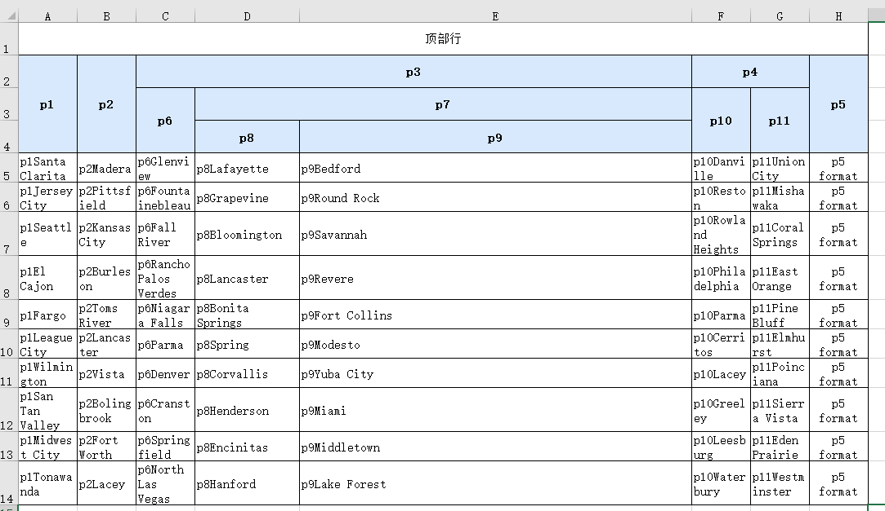

<center>
    一些常用工具
</center>

## 说明
工具中的excel处理基于[exceljs](https://github.com/exceljs/exceljs/blob/master/README_zh.md)
## 下载
```shell
npm install --save @fiveroom/js-tools
```

### 导入
```ts
import { ExportEx } from "@fiveroom/js-tools"
```
## 使用
```ts
    let head: xlsxHeadArr = createheader();
    let e = new ExportEx();
    let sheet = e.addSheet("sheet 1", head, bodyData());
    sheet.getColumn(1).hidden = true;
    sheet.getRow(4).hidden = true;
    e.downLoad();
```

- [隐藏行](https://github.com/exceljs/exceljs/blob/master/README_zh.md#%E5%88%97) 
```ts
worksheet.getRow(4).hidden = true;
```
- [隐藏列](https://github.com/exceljs/exceljs/blob/master/README_zh.md#%E8%A1%8C)
```ts
worksheet.getColumn(4).hidden = true;
```

### 添加顶部行
```ts
let head: xlsxHeadArr = createheader();
let e = new ExportEx();
let sheet = e.addSheet("sheet 1");
sheet.addRow(['顶部行']);
let headInfo = e.addheads(sheet, head); // 添加头
e.addBodyData(bodyData(), sheet, headInfo.bottomHeads);

// 对第一行添加合并
sheet.mergeCells(1, 1, 1, headInfo.maxCol);

// 对第一行添加样式
sheet.getCell(1, 1).style = {
    alignment: ExportEx.defaultHeadStyle.alignment
}
sheet.getCell(1, headInfo.maxCol).style.border = ExportEx.defaultHeadStyle.border;
sheet.getRow(1).height = 30;

e.downLoad()
```


